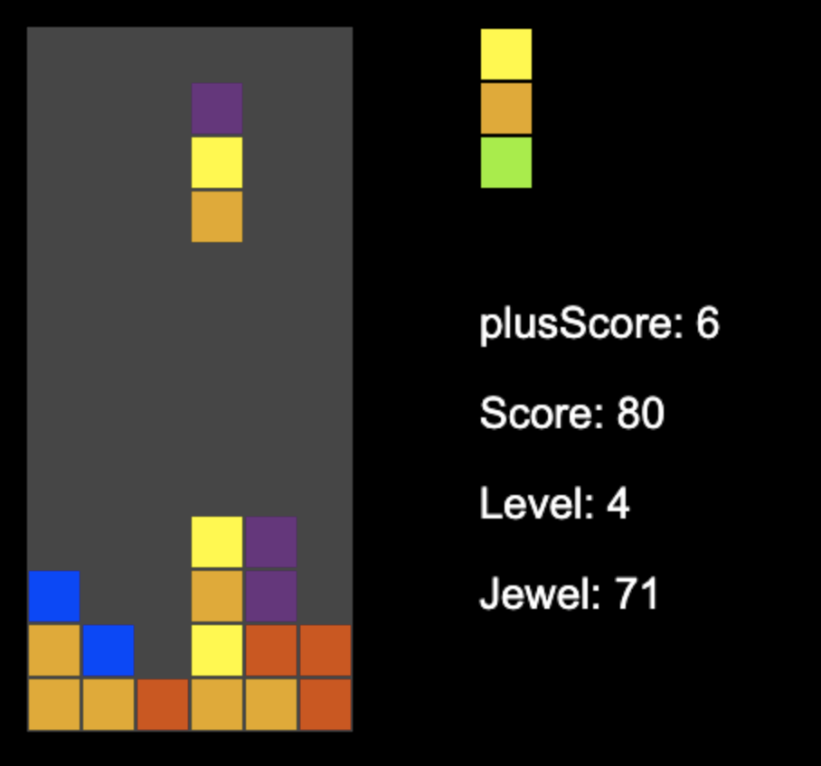

## 開発サーバでの実行
- 場所: http://localhost:3000
- 今回は npm で実行

```sh
npm run dev
```

## ビルド
```sh
npm run build
```

## コラムスの開発手順




### A. 宝石の設定
1. 一回につき、1ブロック(3個の宝石が縦に連なっている)が落ちてくる
2. 宝石は赤、青、緑、黄、オレンジ、紫の6種類

### B. 宝石のスライド
3. 一回ボタンを押したら下方向に操作中のブロックがスライドする

### C. ブロックの移動
4. 左右、下でブロックを操作

### D. ブロックの停止条件
5. 下に移動できなければ(地面や宝石と接すれば)、操作中のブロックは止まる

### E. 宝石の削除機能
6. 同じ種類の宝石が縦、横、斜めに三個以上繋がれば消える
7. 6で消えた時に、浮いている宝石が下に落ちる
8. 落ちた後に、6を実行

### F. ゲームオーバーの条件
9. 一番上のマスのどれかに宝石が設置されたらゲームオーバー

### G. ブロックの自動落下
10. 一定時間ごとにブロックを下に落とす

### H. スコアの算出手順
11. 宝石が消えた時にスコアを増やす
12. スコアは消えた宝石の数に依存する。

### I. 連鎖によるスコアのボーナス
13. 宝石が連鎖で消えた時は、スコアがより増える

### J. レベル機能
14. レベルはスコアに依存する(一定スコアごとにレベルアップ)
15. レベルが上がると宝石が落ちるスピードが上がる


